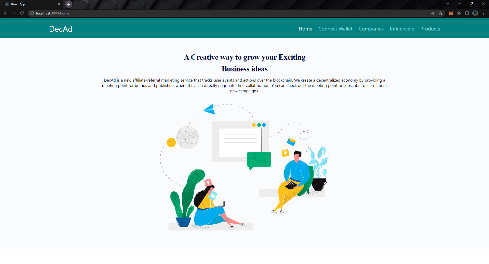
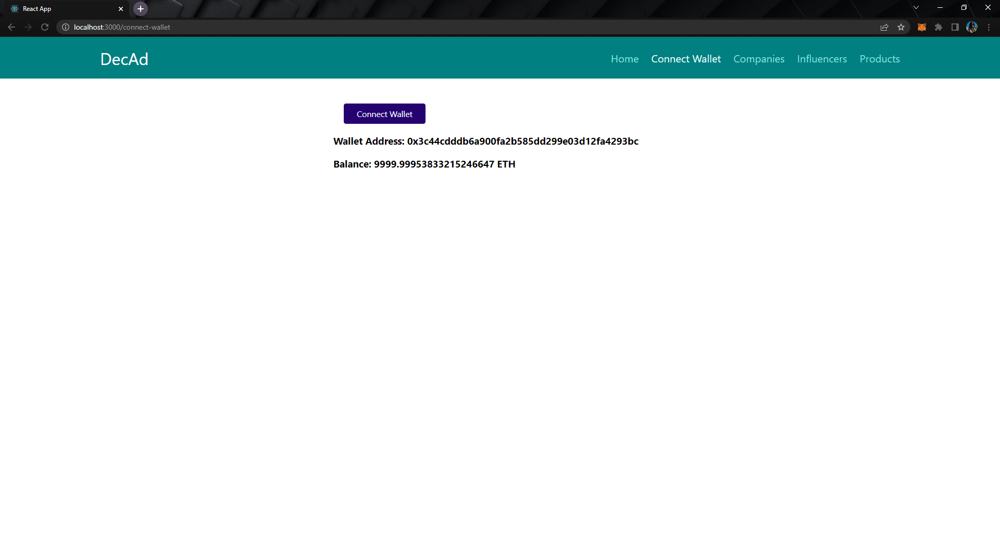
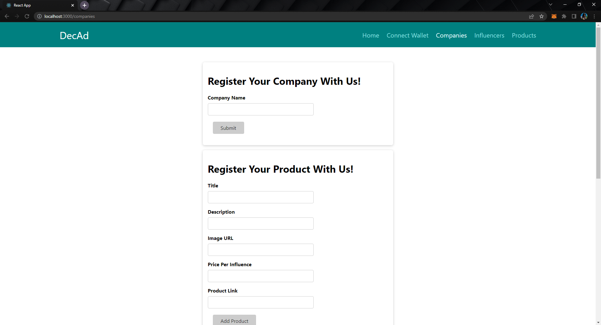
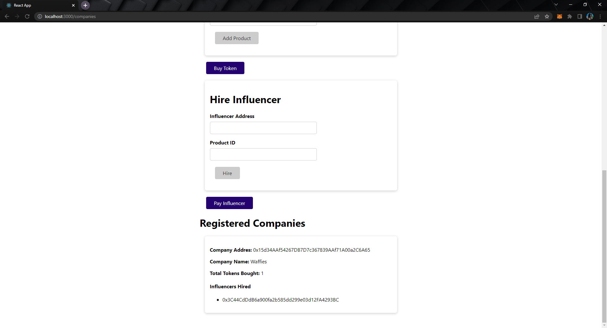
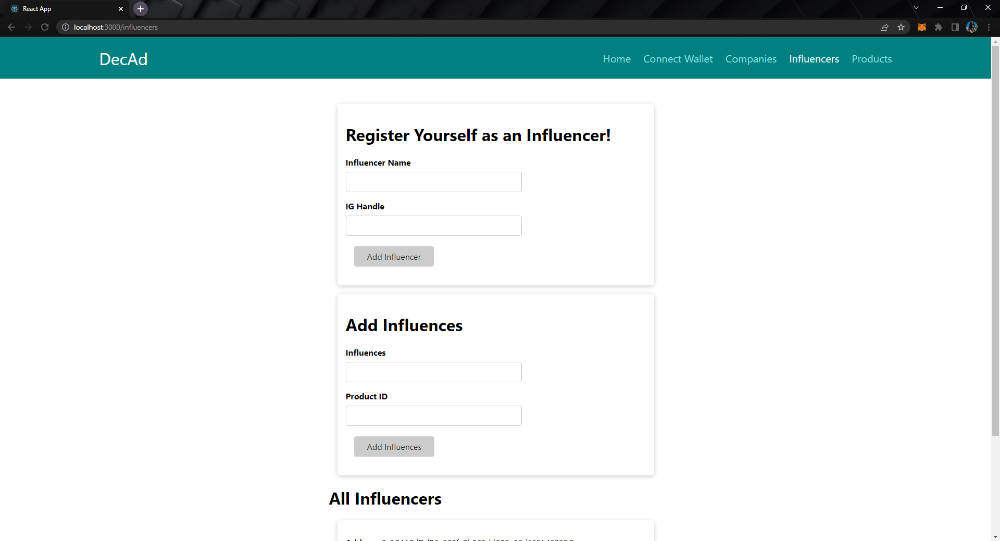
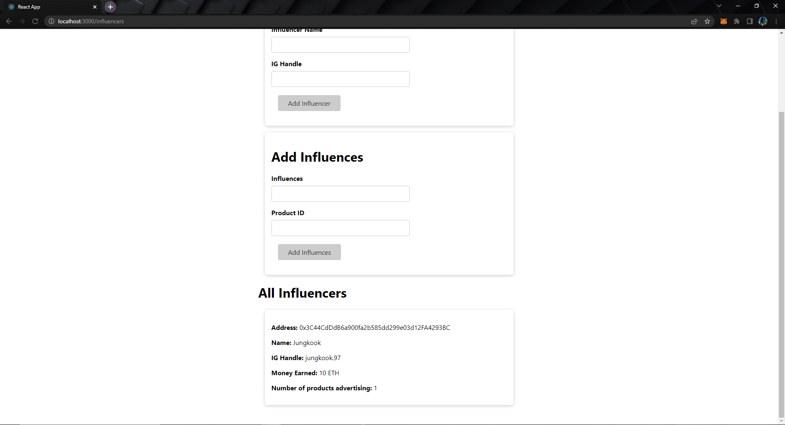
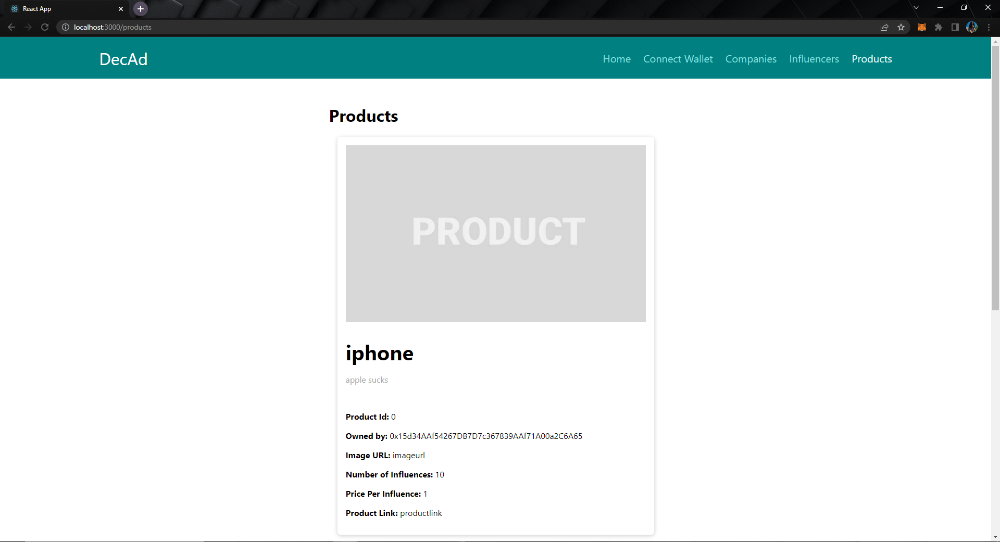

# DecAd (Decentralized Advertisement Platform)


<!-- PROJECT LOGO -->
<br />
<p align="center">

  <h3 align="center">DecAd</h3>

</p>


<!-- ABOUT THE PROJECT -->
## About The Project
DecAd is a new affiliate/referral marketing service that tracks user events and actions over the blockchain. We create a decentralized economy by providing a meeting point for brands and publishers where they can directly negotiate their collaboration.

### Built With
* Solidity
* Hardhat
* Metamask
* React
* Bootstrap

<!-- GETTING STARTED -->
## Getting Started

Here are the instructions on setting up the project locally.
<br>
To get a local copy up and running, follow these steps.

### Prerequisites

First, you need to download and install node.js and npm.
* Download Node.js using this link.
  ```sh
  https://nodejs.org/en/download/
  ```

### Installation

1. Clone the repo
   ```sh
   git clone https://github.com/vidushityagi8/decad-app.git
   ```
2. Install NPM packages
   ```sh
   npm install
   ```
3. Install the Metamask Extension in your browser
   ```sh
   https://metamask.io/
   ```
4. Add a new network `localhost` in Metamask with the following details
   ```sh
   Network Name: localhost
   New RPC URL: https://localhost:8545/
   Chain ID: 31337
   ```
5. Run hardhat node
   ```JS
   npx hardhat node
   ```
6. Deploy the smart contracts
   ```JS
   npx hardhat run scripts/deploy.js --network localhost
   ```
7. Update the `config.js` file in `./src/config.js` with the addresses of your deployed contracts which have been console.logged in your terminal after running the above command
   ```JS
    export const productContractAddress = "0x5FbDB2315678afecb367f032d93F642f64180aa3"
    export const tokenContractAddress = "0xe7f1725E7734CE288F8367e1Bb143E90bb3F0512"
    export const influencerContractAddress = "0x9fE46736679d2D9a65F0992F2272dE9f3c7fa6e0"
    export const companyContractAddress = "0xCf7Ed3AccA5a467e9e704C703E8D87F634fB0Fc9"
   ```
8. Copy the `artifacts` folder from `./` to `./src` 

9. Open a new terminal and start your React App
   ```JS
   npm start
   ```

<!-- USAGE EXAMPLES -->
## Walkthrough


* Home page


* Connect Wallet Page: Connect your wallet with Decad


* Companies Page: Here, companies can register themselves with our platform, register the products they want to advertise. They can also hire the influencer that they want to promote their products through.



* Influencers Page: Here, influencers can register themselves without our platform, search for products from companies that they wish to advertise through their social networking sites and then get paid by the companies according to the number of influences that they are able to generate.



* Products: Here, all the products that are available for advertisement by the companies are listed. These products can be viewed by the influencers so that they can decide which product to choose and promote.



<!-- CONTACT -->
## Contact

Email - vidushityagi8@gmail.com


